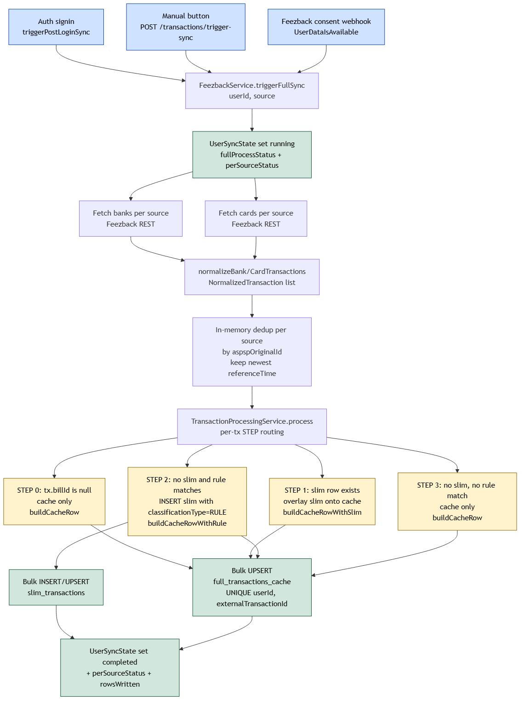
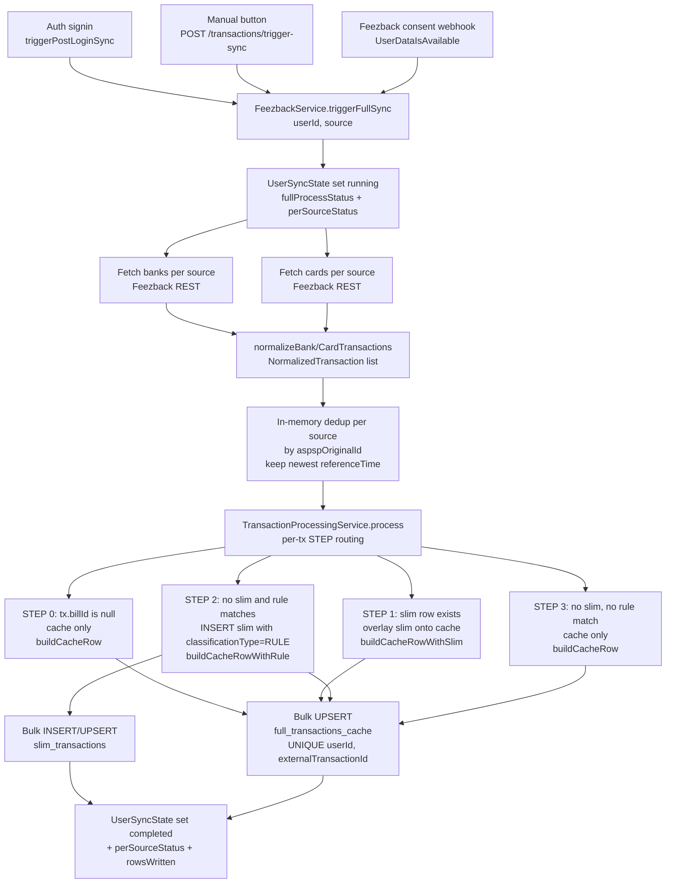
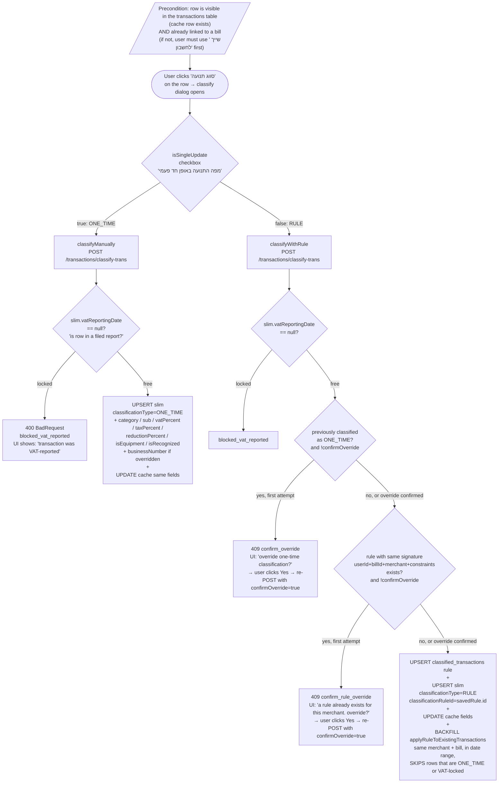
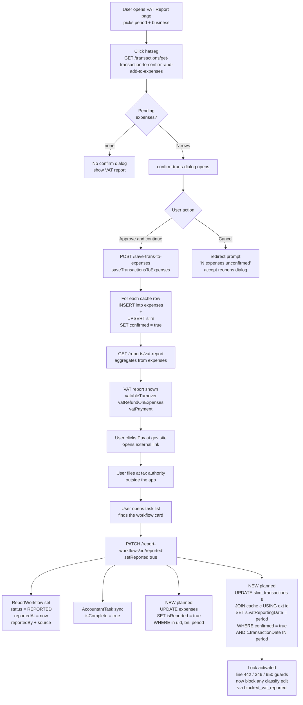
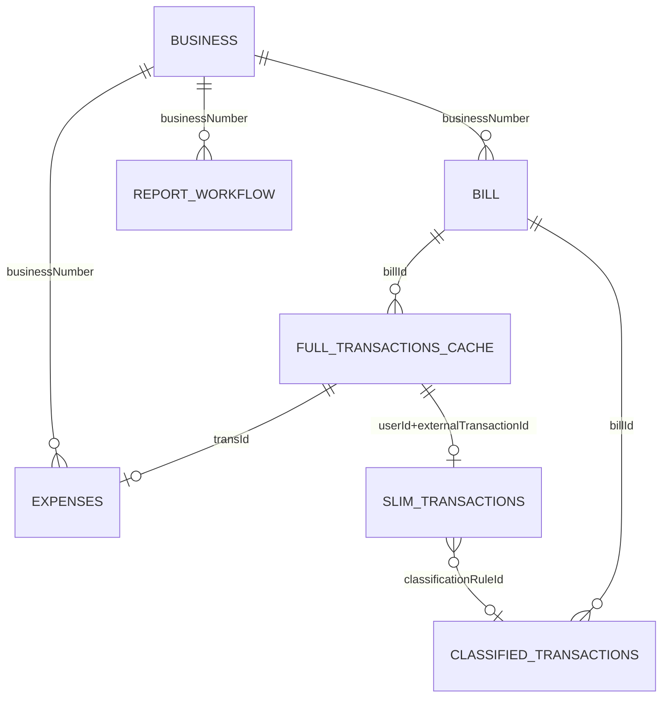

# Architecture diagrams

Visual maps of the three core pipelines (Feezback sync → classification → report) and the database schema behind them.

Each diagram comes in two forms:

- **`.mmd`** — Mermaid source. Edit this when the flow changes; re-render with the command at the bottom of this file.
- **`.png`** — Rendered image. Open in any image viewer; embedded below for at-a-glance browsing.

GitHub also renders the `.mmd` files inline as live SVG when you click them, and the embedded code blocks below render in any Markdown viewer that supports Mermaid (VS Code's preview, JetBrains, etc.).

---

## 1. Feezback Sync Flow

How transactions go from the bank/card aggregator into the local DB, with auto-classification baked in.



<details>
<summary>Mermaid source</summary>



</details>

**Key invariants:**
- Cache rows are written for **every** transaction (steps 0–3). Cache is the raw ledger.
- Slim rows are only written/touched in steps 1 and 2.
- STEP 1's existence check is the **short-circuit** that protects past classifications from rule edits / re-resolution on every sync.
- `matchRule` is deterministic (specificity score + newest-`updatedAt` tie-breaker), so STEP 2 is reproducible.

---

## 2. User-Initiated Classification Flow

Two entry methods (ONE_TIME vs RULE) from the classify dialog, focused on the user-reachable paths.


<details>
<summary>Mermaid source</summary>



</details>

**Note on what's not shown:** the backend also has 404-NotFound and "no billId" guards on the API (defense-in-depth — see `classifyManually` lines 326-340 and `classifyWithRule` lines 420-434), but they're not reachable through normal UI flow:

- The user can only click "סווג תנועה" on a row that's already in the table → cache row obviously exists.
- The classify icon is hidden on rows where `billName === 'לא שוייך'` (see [transactions.page.ts:80-129](frontend/src/app/pages/transactions/transactions.page.ts#L80-L129)) → user must use the "שייך לחשבון" action to link a bill first.

**The `vatReportingDate` lock guards** at `transaction-processing.service.ts` lines **346** (manual), **442** (rule), and **950** (backfill) all check `slim.vatReportingDate != null`. They activate the moment `setReported` writes the period — see the report flow below.

---

## 3. Report Flow (Confirm → File → Lock)

End-to-end from "user has classified some transactions" through "report is filed and locked". The yellow boxes are the **planned** lock writes that need to be added to `setReported`.


<details>
<summary>Mermaid source</summary>



</details>

---

## 4. Database Schema (ER)

How the entities relate. Slim is the classification overlay, Expense is the ledger row, ReportWorkflow is the filing artifact.


<details>
<summary>Mermaid source</summary>



</details>

**Relationship cheat sheet:**
- `cache → slim` is `1:0..1` — every transaction has a cache row; slim only exists once classified.
- `cache → expense` is `1:0..1` via `transId` — only confirmed transactions have an Expense row.
- `slim → classified_transactions` is `0..1:N` — slim's `classificationRuleId` is null for ONE_TIME.
- `business → bill / report_workflow / expenses` are `1:N` via `businessNumber` (string FK, not enforced at DB level).
- The `slim`–`expense` link is *implicit* (both have `transId`-equivalent identity); no FK between them.

---

## Re-rendering after edits

The `.mmd` files are the source of truth. After editing one, regenerate its PNG with the official Mermaid CLI via `npx` (no global install needed):

```bash
cd docs/architecture
npx -y -p @mermaid-js/mermaid-cli mmdc -i 01-sync-flow.mmd -o 01-sync-flow.png -b transparent -w 1800
npx -y -p @mermaid-js/mermaid-cli mmdc -i 02-classification-flow.mmd -o 02-classification-flow.png -b transparent -w 1800
npx -y -p @mermaid-js/mermaid-cli mmdc -i 03-report-flow.mmd -o 03-report-flow.png -b transparent -w 1800
npx -y -p @mermaid-js/mermaid-cli mmdc -i 04-schema.mmd -o 04-schema.png -b transparent -w 1800
```

`-b transparent` keeps the background see-through (works on dark-mode README too); `-w 1800` sets the render width for legibility on big diagrams. First run downloads a headless Chromium (~150 MB cached by npx, not in the repo); subsequent runs are quick.

If `mmdc` doesn't work on a given machine (no Chromium download), paste the `.mmd` content into [mermaid.live](https://mermaid.live), click Export → PNG, and overwrite the file.

## Key source files

| Concern | File |
|---|---|
| Sync entry triggers | `backend/src/transactions/transactions.controller.ts:127-161`, `backend/src/users/users.controller.ts`, `backend/src/feezback/webhook/feezback-webhook.service.ts` |
| Sync orchestration | `backend/src/feezback/feezback.service.ts` — `triggerFullSync`, `normalizeBank/CardTransactions` |
| STEP 0–3 routing | `backend/src/transactions/transaction-processing.service.ts:124-227` `process()` |
| Build helpers | `backend/src/transactions/transaction-processing.service.ts:1072-1149` (buildCacheRow / buildCacheRowWithSlim / buildCacheRowWithRule) |
| Rule matching | `backend/src/transactions/transaction-processing.service.ts:1007-1070` `matchRule` |
| Manual classify | `backend/src/transactions/transaction-processing.service.ts:321-387` `classifyManually` |
| Rule classify + backfill | `backend/src/transactions/transaction-processing.service.ts:415-562` `classifyWithRule`, `884-1000` `applyRuleToExistingTransactions` |
| Lock guards | `backend/src/transactions/transaction-processing.service.ts:346, 442, 950` — all check `slim.vatReportingDate != null` |
| Save to ledger | `backend/src/transactions/transactions.service.ts:1620-1654` `saveTransactionsToExpenses` (sets `slim.confirmed = true` + creates Expense rows) |
| VAT report calc | `backend/src/reports/reports.service.ts` — aggregates from `expenses` |
| Report workflow | `backend/src/report-workflow/report-workflow.service.ts:120-168` `setReported` (where the planned slim/expense lock writes will hook) |
| Sync state | `backend/src/transactions/user-sync-state.service.ts` — drives the polling status the UI shows |
| Period helpers | `backend/src/shared/shared.service.ts:107-145` `getVATReportingDate`, `62-81` `getStartAndEndDate` |
| Schemas | `backend/src/transactions/full-transaction-cache.entity.ts`, `backend/src/transactions/slim-transaction.entity.ts`, `backend/src/transactions/classified-transactions.entity.ts`, `backend/src/expenses/expenses.entity.ts`, `backend/src/report-workflow/report-workflow.entity.ts` |
