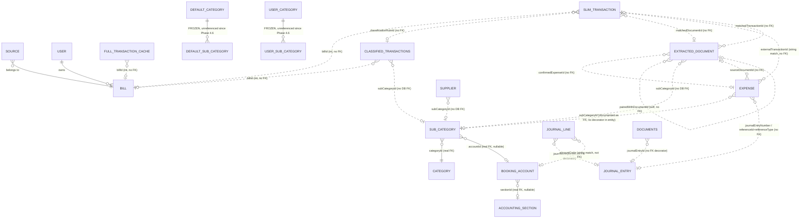
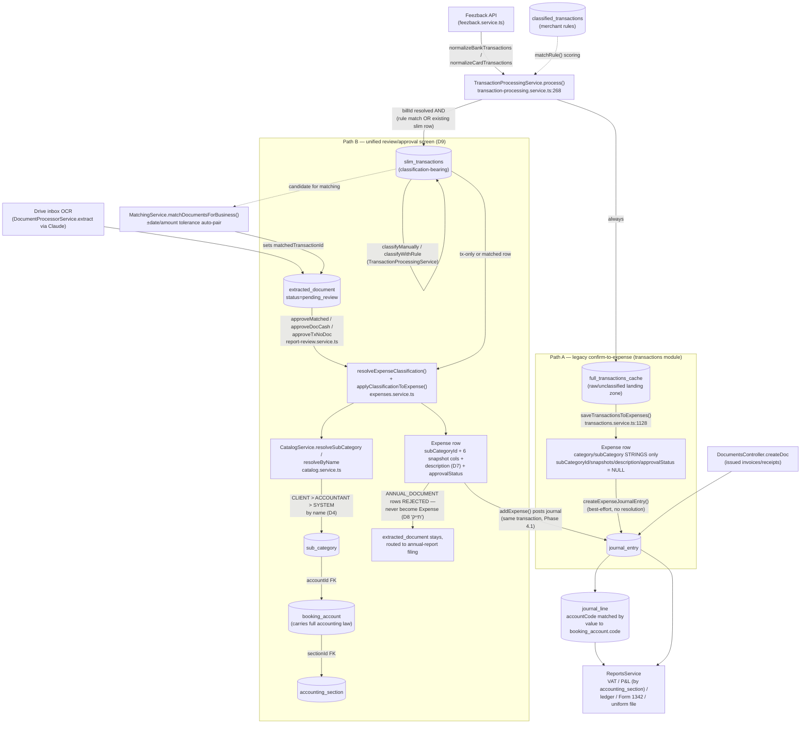

# KeepInTax — Transactions / Expenses / Categories layer: full map

Generated by direct code inspection (no assumptions from prior docs) on
2026-07-20, against the state of `main` at the time (post categories-redesign
Phase 6, `Current phase: cutover-in-progress` per root `CLAUDE.md`). Every
finding below cites an exact file path. Read together with
`docs/redesign/categories-redesign-master-plan.md` (the design spec — D1–D15)
which this document verifies against the actual code, not the other way
around.

Two systems coexist in the codebase right now:
- **OLD (frozen, read-only since Phase 2.5)**: `default_category` /
  `default_sub_category` / `user_category` / `user_sub_category`.
- **NEW (live since Phase 2–4)**: `accounting_section` / `booking_account` /
  `category` / `sub_category`.

The old tables are still schema-managed (kept for rollback) but no service
writes to them anymore — see §4.

---

## 1. Entity inventory

### 1.1 Open Banking / sync layer (`backend/src/feezback/`, `backend/src/transactions/`)

| Table (Entity) | File | Key columns | Relations |
|---|---|---|---|
| `feezback_webhook_events` (`FeezbackWebhookEvent`) | `backend/src/feezback/webhook/entities/feezback-webhook-event.entity.ts` | `id` (uuid PK), `receivedAt`, `eventType` varchar(128), `payloadJson` json, `payloadHash` varchar(64) **UNIQUE** (`IDX_fbw_payload_hash`), `processedAt` nullable, `processingError` nullable text | none — standalone audit log |
| (no entity — `Source`) `source` | `backend/src/transactions/source.entity.ts` | `id`, `userId`, `sourceName`, `sourceType` enum `SourceType` (`CREDIT_CARD`\|`BANK_ACCOUNT`) not-null | `ManyToOne → Bill` (`bill`); **UNIQUE** `IDX_source_userId_sourceName` on `(userId, sourceName)` |
| `bill` (`Bill`) | `backend/src/transactions/bill.entity.ts` | `id`, `billName`, `userId`, `businessNumber` | `OneToMany → Source[]` (`sources`); `ManyToOne → User` (`user`) |
| `user_sync_state` (`UserSyncState`) | `backend/src/transactions/user-sync-state.entity.ts` | `id`, `userId` **UNIQUE** (`UQ_sync_state_user`), `triggeredBy`, `fullProcessStatus`/`fullResultStatus`/`fullRowsWritten`/`fullStartedAt`/`fullFinishedAt`/`fullFailureReason`/`fullSkipReason`, `lastSourcesRefreshAt`, `lastConsentInitiatedAt` | none — per-user singleton row |
| `user_source_sync_state` (`UserSourceSyncState`) | `backend/src/transactions/user-source-sync-state.entity.ts` | `id`, `userId`, `sourceId` (`UQ_source_sync_user_source` unique on `(userId, sourceId)`), `type` (`bank`\|`card`), `resourceId`, `consentId`, `status` (`not_synced`\|`success`\|`failed`), `transactionCount`, `error` | none — per (user, source) row |
| `user_transaction_cache_state` (`UserTransactionCacheState`) | `backend/src/transactions/user-transaction-cache-state.entity.ts` | `id`, `userId` **UNIQUE** (`UQ_cache_state_user`), `lastBuiltAt`, `expiresAt` | none |

**Ownership model**: none of the above carry SYSTEM/ACCOUNTANT/CLIENT ownership fields — they are plain per-`userId` rows (Firebase UID). This layer predates and is orthogonal to the D4 ownership model, which only applies to the catalog tables (§1.4).

### 1.2 Transaction pipeline (`backend/src/transactions/`)

| Table (Entity) | File | Key columns | Relations |
|---|---|---|---|
| `transactions` (`Transactions`) — **legacy, being phased out** | `backend/src/transactions/transactions.entity.ts` | `id`, `finsiteId` nullable, `userId`, `paymentIdentifier` nullable, `billName`/`businessNumber` nullable, `name`, `note2` nullable, `billDate` date, `payDate` nullable date, `sum` decimal(10,2), `category`/`subCategory` nullable varchar (free string, no FK), `isRecognized`/`vatPercent`/`taxPercent`/`isEquipment`/`reductionPercent` nullable, `vatReportingDate` nullable varchar, `confirmed` boolean default false | none — flat table, no FK to catalog or bookkeeping at all |
| `slim_transactions` (`SlimTransaction`) | `backend/src/transactions/slim-transaction.entity.ts` | `id`, `externalTransactionId` varchar, `userId` varchar, `billId` int **not-null** (comment: "a slim row must never exist without a billId — enforced at service layer"), `classificationType` enum (`ClassificationType`), `classificationRuleId` nullable int, `category`/`subCategory` varchar (string, no FK), `confirmed` boolean default false, `taxPercent`/`vatPercent` int default 0, `vatReportingDate` nullable varchar, `isLocked` boolean default false, `reductionPercent` int default 0, `isEquipment`/`isRecognized` boolean default false, `reportScope` enum `ExpenseReportScope` default `PNL`, `businessNumber` nullable, `matchedDocumentId` nullable int, `createdAt`/`updatedAt` | **UNIQUE** `UQ_slim_user_external` on `(userId, externalTransactionId)`; `IDX_slim_userId`. No formal FK to `bill`, `classified_transactions`, or the catalog — `billId`/`classificationRuleId`/`matchedDocumentId` are plain ints. |
| `full_transactions_cache` (`FullTransactionCache`) | `backend/src/transactions/full-transaction-cache.entity.ts` | `id`, `externalTransactionId`, `userId`, `billId`/`billName`/`businessNumber` nullable, `merchantName`, `note` nullable **TEXT**, `transactionDate` date, `paymentDate` nullable date, `paymentIdentifier` nullable, `amount` decimal(10,2), `currency` varchar(3) default `'ILS'`, `ilsAmount` decimal(12,2) nullable, `fxRateToIls` decimal(12,6) nullable, `category`/`subCategory` nullable varchar, `isRecognized` bool default false, `vatPercent`/`taxPercent` int default 0, `isEquipment` bool default false, `reductionPercent` int default 0, `vatReportingDate` nullable, `isLocked` bool default false (mirror of slim), `confirmed` bool default false, `classificationType` nullable enum, `reportScope` enum default `PNL` | **UNIQUE** `UQ_cache_user_external` on `(userId, externalTransactionId)`; indexes on `userId`, `billId`, `transactionDate`. Denormalized read model — no formal FK anywhere. |
| `classified_transactions` (`ClassifiedTransactions`) | `backend/src/transactions/classified-transactions.entity.ts` | `id`, `userId`, `transactionName` (merchant match key), `billId` int, `category`/`subCategory` string, `necessity` enum, `isExpense`/`isRecognized`/`isEquipment` bool, `vatPercent`/`taxPercent`/`reductionPercent`, `reportScope` enum default `PNL`, `startDate`/`endDate` nullable date, `minAbsSum`/`maxAbsSum` nullable decimal(10,2), `commentPattern` nullable, `commentMatchType` enum (`equals`\|`contains`) default `equals`, `businessNumber` nullable override, `createdAt`/`updatedAt`, **`subCategoryId` int nullable** (D6/Phase 3.1 addition) | `IDX_rule_user_bill_merchant` on `(userId, billId, transactionName)`. `subCategoryId` is a **display-only pointer, no real DB FK** ("same no-real-FK precedent as `Supplier.subCategoryId`") — backfilled by name in Phase 3.5, stays NULL if unmatched. |

### 1.3 Expense / supplier layer (`backend/src/expenses/`)

| Table (Entity) | File | Key columns | Relations |
|---|---|---|---|
| `expense` (`Expense`) | `backend/src/expenses/expenses.entity.ts` | `id`, `supplier`, `supplierID` nullable, `category`/`subCategory` **string, always required** (not null), `sum` decimal(10,2), `taxPercentSnapshot`/`vatPercentSnapshot` decimal(5,2) *(renamed in place from `taxPercent`/`vatPercent`, D6)*, `date`, `businessNumber`, `note`/`file` nullable, `isEquipmentSnapshot` bool *(renamed from `isEquipment`)*, `userId`, `loadingDate`, `expenseNumber` nullable, `reductionDone` nullable, `reductionPercentSnapshot` *(renamed from `reductionPercent`)*, `totalTaxPayable`/`totalVatPayable` decimal(10,2) nullable, `transId` nullable int, `externalTransactionId` nullable varchar (link back to slim/cache row), `sourceDocumentId` nullable int (link to `extracted_document.id`), `originalCurrency` nullable varchar(3), `originalSum` nullable decimal(12,2), `vatReportingDate` nullable, `isReported` nullable bool, `reportScope` enum default `PNL`, `pnlCategory` nullable string (legacy per-expense override — see §6 ambiguity), `journalEntryNumber` nullable int — **then the D6 (Phase 3) additions, all nullable**: `subCategoryId` int (comment says "real DB constraint" but **no `@ManyToOne`/FK decorator exists in the entity file** — see §6), `sectionIdSnapshot`/`sectionCodeSnapshot`/`sectionNameSnapshot`, `accountIdSnapshot`/`accountCodeSnapshot`/`accountNameSnapshot`, `code6111Snapshot`, `description`, `approvalStatus` enum `ExpenseApprovalStatus` nullable, `approvedByUserId`/`approvedAt`, `classificationOverrideByUserId`/`classificationOverrideAt` | No `@ManyToOne`/`@JoinColumn` decorators at all in this entity — every "relation" (`subCategoryId`, `sourceDocumentId`, `externalTransactionId`) is a bare int/varchar column resolved by the service layer, not TypeORM. |
| `incomes` (`Income`) — legacy | `backend/src/expenses/incomes.entity.ts` | not read in this pass (out of scope — flagged in topic doc as legacy, simpler income record) | — |
| `supplier` (`Supplier`) | `backend/src/expenses/suppliers.entity.ts` | `id`, `supplier`, `category`, `supplierID` nullable, `subCategory`, `taxPercent`/`vatPercent` decimal, `userId`, `businessNumber`, `isEquipment` bool, `reductionPercent`, `subCategoryId` int nullable (D6, **display-only, no DB FK**, same precedent) | **UNIQUE** `uq_supplier_business_supplierid` on `(businessNumber, supplierID)` — MySQL treats NULL as distinct, so cash/foreign suppliers without a tax ID can coexist |

### 1.4 OLD catalog — frozen since Phase 2.5, unreferenced at runtime since Phase 4.6

| Table (Entity) | File | Key columns |
|---|---|---|
| `default_category` (`DefaultCategory`) | `backend/src/expenses/default-categories.entity.ts` | `id`, `categoryName`, `isExpense` bool, `accountCode` nullable (→ old `default_booking_account.code`) |
| `default_sub_category` (`DefaultSubCategory`) | `backend/src/expenses/default-sub-categories.entity.ts` | `id`, `subCategoryName`, `categoryName`, `taxPercent`/`vatPercent`/`reductionPercent` decimal(5,2), `isEquipment`/`isRecognized`/`isExpense` bool, `necessity` enum, `reportScope` enum default `PNL`, `pnlCategory` nullable, `accountCode` nullable, `subAccountCode` nullable varchar(10) |
| `user_category` (`UserCategory`) | `backend/src/expenses/user-categories.entity.ts` | `id`, `categoryName`, `firebaseId`, `businessNumber`, `isExpense` bool, `accountCode` nullable override |
| `user_sub_category` (`UserSubCategory`) | `backend/src/expenses/user-sub-categories.entity.ts` | `id`, `firebaseId`, `businessNumber`, `subCategoryName`, `categoryName`, same percent/flag columns as `default_sub_category`, `accountCode` nullable |

All four entity files carry an explicit header comment: *"FROZEN legacy table … read-only since Phase 2.5, fully UNREFERENCED at runtime since Phase 4.6 — registered only in AppModule's forRoot entities list so the table stays schema-managed for rollback. Dropped in Phase 7."* Confirmed no service in `backend/src/**` injects their repositories outside `app.module.ts`'s entity list (per `expenses/CLAUDE.md` and the master plan's Phase 4.6 log).

### 1.5 NEW catalog (D1/D4, `backend/src/bookkeeping/`)

| Table (Entity) | File | Key columns | Relations |
|---|---|---|---|
| `accounting_section` (`AccountingSection`) — חתך | `backend/src/bookkeeping/accounting-section.entity.ts` | `id`, `code`, `name`, `ownerType` enum `OwnerType` default `SYSTEM`, `chartOwnerKey` default `'SYSTEM'`, `accountantId`/`userId`/`businessNumber` nullable, `visibilityScope` nullable enum, `displayOrder` nullable int, `isActive` default true, `createdAt`/`updatedAt` | **UNIQUE** `uq_accounting_section_owner_code` on `(chartOwnerKey, code)` |
| `booking_account` (`BookingAccount`) — כרטיס | `backend/src/bookkeeping/account.entity.ts` | `id`, `code`, `name`, `type` (`asset`\|`liability`\|`equity`\|`income`\|`expense`), `pnlCategory` nullable (**DEAD since Phase 4.4** — kept for rollback), `displayOrder` nullable (**temporary**, superseded by section), `sectionId` nullable int, `code6111` nullable, `vatPercent`/`taxPercent`/`reductionPercent` decimal(5,2) nullable, `isEquipment` nullable bool, `recognitionType` nullable enum `RecognitionType` (`RECOGNIZED`\|`NOT_RECOGNIZED`\|`NOT_APPLICABLE`), `reportScope` enum `ExpenseReportScope` (`pnl`\|`annual`\|`technical`) default `PNL`, `ownerType`/`chartOwnerKey`/`accountantId`/`userId`/`businessNumber`/`visibilityScope` (D4), `isActive` default true | `ManyToOne → AccountingSection` (`section`, via `sectionId`/`@JoinColumn`, nullable). **UNIQUE** `uq_booking_account_owner_code` on `(chartOwnerKey, code)`. |
| `category` (`Category`) — קטגוריה | `backend/src/bookkeeping/category.entity.ts` | `id`, `name`, `type` enum `CategoryType` (`EXPENSE`\|`INCOME`), `defaultRecognitionType` nullable enum (UI hint only), `ownerType`/`chartOwnerKey`/`accountantId`/`userId`/`businessNumber`/`visibilityScope` (D4), `isDefault` default false, `isActive` default true, `createdByUserId` nullable, `createdAt`/`updatedAt` | **UNIQUE** `uq_category_owner_name_type` on `(chartOwnerKey, name, type)` |
| `sub_category` (`SubCategory`) — תת-קטגוריה | `backend/src/bookkeeping/sub-category.entity.ts` | `id`, `categoryId` int, `name`, `isPrivate` default false, `accountId` nullable int, `necessity` enum default `IMPORTANT`, `ownerType`/`chartOwnerKey`/`accountantId`/`userId`/`businessNumber`/`visibilityScope` (D4), `approvalStatus` enum `ApprovalStatus` default `APPROVED`, `approvedByUserId`/`approvedAt`, `rejectedByUserId`/`rejectedAt`/`rejectionReason`, `isDefault` default false, `isActive` default true, `createdByUserId`, `createdAt`/`updatedAt` | `ManyToOne → Category` (`category`, via `categoryId`/`@JoinColumn`, **real FK**); `ManyToOne → BookingAccount` (`account`, via `accountId`/`@JoinColumn`, nullable, **real FK**). **UNIQUE** `uq_sub_category_owner_category_name` on `(chartOwnerKey, categoryId, name)`; indexes on `categoryId`, `accountId`. |
| `account_code_migration` (`AccountCodeMigration`) — migration artifact only | `backend/src/bookkeeping/account-code-migration.entity.ts` | `id`, `oldCode`, `newCode`, `source` enum (`accountCode`\|`subAccountCode`), `createdAt` | **UNIQUE** `uq_account_code_migration_oldCode` on `oldCode` |

`sub_category` is the **only** catalog table with real TypeORM `@ManyToOne`/`@JoinColumn` FK decorators (to `category` and `booking_account`). `category`, `booking_account`, `accounting_section` have no relations pointing *out* of them in the entity files — the D4 ownership fields (`chartOwnerKey` etc.) are plain scalar columns, not FKs.

### 1.6 Journal (`backend/src/bookkeeping/`)

| Table (Entity) | File | Key columns | Relations |
|---|---|---|---|
| `journal_entry` (`JournalEntry`) | `backend/src/bookkeeping/jouranl-entry.entity.ts` *(filename typo, noted for Phase 7.3 cleanup)* | `id` (global PK), `entryNumber` nullable int (per-business display number), `issuerBusinessNumber`, `firebaseId` default `''`, `date` date, `description` nullable, `referenceType` nullable enum `JournalReferenceType`, `referenceId` nullable bigint, `valueDate`/`vatDate` nullable date, `notes` nullable, `vatReportingPeriod` nullable varchar, `subCategory` nullable varchar (sub-category **name**, string only), `counterAccountCode` nullable varchar (string, not FK), `counterPartyName` nullable, `documentTotal` decimal(12,2) nullable, `createdAt` | No FK decorators. `referenceId` + `referenceType` is the polymorphic pointer back to the source `expense`/`Documents` row (application-level join, not a DB FK). |
| `journal_line` (`JournalLine`) | `backend/src/bookkeeping/jouranl-line.entity.ts` | `id`, `issuerBusinessNumber`, `firebaseId` default `''`, `journalEntryId` int (plain int, **no FK decorator/relation** to `JournalEntry`), `lineInEntry` int, `accountCode` string (**string, not a FK to `booking_account.id`** — matched by `code` value at query time), `debit`/`credit` decimal(12,2) default 0, `amountBeforeVat`/`vatAmount` decimal(12,2) default 0, `isEquipment` nullable bool default false, `taxPercent`/`vatPercent` decimal(5,2) default 100, `amountForTax` decimal(12,2) default 0, `subCategoryName` nullable (string, not FK) | No relations at all — pure flat table, joined to `JournalEntry` by `journalEntryId` value and to `BookingAccount` by `accountCode` value, both at the service/query-builder level. |

### 1.7 Document layer (`backend/src/documents/`)

| Table (Entity) | File | Key columns | Relations |
|---|---|---|---|
| `documents` (`Documents`) — issued docs | `backend/src/documents/documents.entity.ts` | `id`, issuer/recipient detail columns, `docType` enum, `docNumber` varchar(20), VAT/sum decimal fields, `docDate`/`issueDate`/`valueDate`, `docStatus` enum, parent-doc linkage (`parentDocType`/`parentDocNumber`/`parentBranchCode`), `file`/`copyFile` (storage paths), `journalEntryNumber` nullable int, `journalEntryId` nullable int | **UNIQUE** `uq_documents_business_doctype_docnumber` on `(issuerBusinessNumber, docType, docNumber)`. `journalEntryId` is a plain int, no FK decorator, joined by value to `journal_entry.id`. |
| `setting_documents` (`SettingDocuments`) | `backend/src/documents/settingDocuments.entity.ts` | `id`, `userId`, `issuerBusinessNumber` nullable, `docType` enum, `initialIndex` nullable, `currentIndex` default 0 | **UNIQUE** `uq_setting_documents_user_business_doctype` on `(userId, issuerBusinessNumber, docType)`. Reused generically as a per-business counter (e.g. journal entry numbers) by other modules too. |
| `extracted_document` (`ExtractedDocument`) — inbound OCR | `backend/src/documents/extracted-document.entity.ts` | `id`, `userId` int, `businessNumber` nullable varchar(32), `driveFileId`, `driveFileMd5` nullable, `subIndex` default 0, `driveFileName`, `month` varchar(7) (`YYYY-MM`), `supplier`/`supplierId` nullable, `date` nullable (string), `invoiceNumber`/`allocationNumber` nullable, `amount`/`vat`/`amountBeforeVat` decimal(12,2) nullable, `currency` varchar(3) nullable (NULL = ILS), `ilsAmount`/`fxRateToIls` nullable, `pairedWithDocumentId` nullable int, `category`/`subCategory` nullable varchar (string), `taxPercent`/`vatPercent` decimal(6,2) nullable, `isEquipment` nullable bool, `description` nullable text, `status` varchar(32) default `pending_review` (enum `ExtractedDocStatus`, **stored as varchar not DB enum** — "so adding a new state doesn't require an ALTER"), `documentType` nullable varchar(50) (enum `ExtractedDocumentType`), `uploadDate` nullable datetime, `rawResponse` nullable text, `confirmedExpenseId` nullable int, `matchedTransactionId` nullable int, `matchStatus` nullable (`matched`\|`manual_link`), `createdAt`/`updatedAt`, `subCategoryId` nullable int (D6, **display-only, no DB FK**, same precedent), `documentKind` nullable varchar(32) (enum `DocumentKind`: `EXPENSE_INVOICE`\|`ANNUAL_DOCUMENT`\|`UNIDENTIFIED`, D8) | **UNIQUE** `uq_extracted_document_file_subindex` on `(driveFileId, subIndex)`. Indexes: `ix_extracted_document_user_business_month` on `(userId, businessNumber, month)`; `IDX_extracted_document_biz_md5` (not unique) on `(businessNumber, driveFileMd5)`; `ix_extracted_doc_matched_tx` on `matchedTransactionId`; `ix_extracted_document_paired_with` on `pairedWithDocumentId`. All 5 indexes are named explicitly in the entity — the file's own comment explains this was a deliberate fix after "an accidental synchronize run against keepintax_prodcopy dropped all 5" (`docs/redesign/schema-drift.md` Gap 7). No FK decorators anywhere — `confirmedExpenseId`, `matchedTransactionId`, `pairedWithDocumentId`, `subCategoryId` are all plain ints resolved by service code. |

**Ownership model across this whole layer**: only the four NEW catalog tables (§1.5) carry the D4 SYSTEM/ACCOUNTANT/CLIENT ownership columns. Every transaction/expense/document/supplier/rule table uses plain `userId` (Firebase UID) + `businessNumber` scoping instead — there is no `ownerType` concept below the catalog.

---

## 2. Data-flow: Open Banking pull → raw transaction

- **Entry points** (`backend/src/feezback/feezback.service.ts`):
  - `getAndSaveBankTransactions` → `normalizeBankTransactions` (private method, line 1025) → `this.processingService.process(userId, normalizedTransactions)` (call site line 770).
  - `getAndSaveUserCardTransactions` → `normalizeCardTransactions` (line 1117) → `process()` (call site line 1914).
  - Webhook-triggered full sync and admin manual pull-source paths also funnel through the same `normalizeBankTransactions`/`process()` pair (call sites at lines 2164, 2233).
  - `paymentIdentifier` is derived per source via `deriveSourceName(rawId, currency)` (lines 636, 997) — this is the join key `TransactionProcessingService.process()` uses to resolve `billId`/`billName`/`businessNumber` from the `Source`/`Bill` tables.
- **`TransactionProcessingService.process()`** (`backend/src/transactions/transaction-processing.service.ts:268-481`) is the single ingestion funnel for ALL sources (bank, card, any future source) — it does NOT write to `Transactions` (the legacy monolithic table) at all; only `slim_transactions` and `full_transactions_cache`.
  - STEP 0: no resolvable `billId` (no matching `Source`/`Bill` row for the payment identifier) → row goes to `full_transactions_cache` ONLY, `skippedNoBillId++`. Classification is blocked for these rows (no `Bill` = no business/user context to classify against).
  - STEP 1: a `slim_transactions` row already exists for `(userId, externalTransactionId)` → the existing classification is overlaid onto the cache row; rule matching is skipped entirely (this is what prevents a rule from silently overwriting a `ONE_TIME` manual classification).
  - STEP 2: no existing slim row → `matchRule(tx, userRules)` runs deterministic scoring against the user's `ClassifiedTransactions` rules for that `billId` (see docstring lines 15-23 of `classified-transactions.entity.ts` for the scoring/tie-break algorithm) — a match creates a new `slim_transactions` row (`classificationType = RULE`) **and** a cache row.
  - STEP 3: no rule match → cache-only row, unclassified (`category`/`subCategory` stay NULL on the cache row).
  - Non-ILS rows get an FX stamp (`ilsAmount`/`fxRateToIls`) resolved via `FxRateService.getRate()` per `(date, currency)`, cached in-memory + DB-cached across the batch.
  - Persistence: `slim_transactions` INSERT is `INSERT ... ON DUPLICATE KEY IGNORE` (race-safe, never overwrites an existing `ONE_TIME` row); `full_transactions_cache` is a batched UPSERT keyed on `(userId, externalTransactionId)`.

So the very first landing table for a raw bank/card transaction is **always `full_transactions_cache`**; it additionally lands in **`slim_transactions`** only if a `billId` was resolvable AND (a rule matched, or a slim row already existed from a prior manual classification).

There is **no separate "raw transaction" staging table** distinct from `full_transactions_cache` — the cache table itself is the raw/unclassified landing zone, and `slim_transactions` is the classification-bearing subset. This differs from a strict "raw → candidate → confirmed" three-table model; it's a two-table (cache + slim) model with `confirmed`/`isLocked` flags layered on top, not a status enum.

---

## 3. Pending vs. approved: two parallel paths — this is a genuine fork, not one canonical flow

**Path A — legacy "confirm to expense" (transactions module).**
`TransactionsService.saveTransactionsToExpenses` (`backend/src/transactions/transactions.service.ts:1128-1280+`), invoked from the flow-report/transactions "confirm" action:
1. Loads `full_transactions_cache` rows by id, and their matching `slim_transactions` rows by `externalTransactionId`.
2. Builds an `Expense` **directly from the cache row's raw `category`/`subCategory` strings** (`expense.category = row.category`, `expense.subCategory = row.subCategory`, lines 1197-1198) — it does **not** call `ExpensesService`'s classification resolver at all (see §6, finding 1).
3. Saves the `Expense`, then calls `this.expenseService.createExpenseJournalEntry(saved)` per row (best-effort, swallows its own failures).
4. Flips the source `slim_transactions` rows' `confirmed = true` (period label is NOT recomputed here — it uses whatever was already stamped at classification time).

**Path B — unified review-modal approval (D9, reports module).**
`ReportReviewService.approveMatched` / `approveDocCash` / `approveTxNoDoc` (`backend/src/reports/report-review.service.ts:560+, 728+, 861+`), invoked from the report-review page (`frontend/src/app/pages/report-review/`):
1. Loads the relevant `ExtractedDocument` and/or `SlimTransaction`+`FullTransactionCache` rows.
2. D8 gate: `documentKind === ANNUAL_DOCUMENT` rows are rejected outright (400) — they must go through the "תייק" filing flow instead, never become an `Expense`.
3. Resolves final category/subCategory/vat%/tax%/equipment/sum/date by an override > doc > slim precedence chain.
4. Calls `ExpensesService.addExpense(...)`, **passing its own transactional `manager`** so expense + journal + doc/slim flips are atomic in ONE db transaction.
5. `addExpense` (`backend/src/expenses/expenses.service.ts:513-610+`) runs the full D6 pipeline: `resolveExpenseClassification()` → `applyClassificationToExpense()` — writes `subCategoryId`, all six snapshot columns, `description` (D7), and `approvalStatus` together.
6. Stamps `extracted_document.status = APPROVED`, `confirmedExpenseId`, `documentKind = EXPENSE_INVOICE`; cascades approval to a paired invoice; flips `slim_transactions.confirmed = true` + `vatReportingDate`.

**These are functionally different pipelines producing structurally different `Expense` rows** — see §6 for the consequence (Path A rows are missing the D6 snapshot/description/approvalStatus columns that Path B always fills). The master plan's Phase 4.1 log entry ("every write path funnels through resolveExpenseClassification") is true for `addExpense`/`reclassifyExpense`/`reclassifyExpenseFromNames`/`overrideExpenseMapping`/`completeExpenseMapping`, but **not** true for `saveTransactionsToExpenses` — that function calls `expenseService.createExpenseJournalEntry` directly, bypassing the classification/snapshot step (`ExpensesService.createExpenseJournalEntry`, `backend/src/expenses/expenses.service.ts:1451-1466`).

**Status representation — no single "pending" table.** There is no `status = 'pending'` row type shared by both paths:
- Bank/card side: "pending approval" = a `full_transactions_cache` row with `confirmed = false` (Path A) — cache and slim both carry `confirmed`, not a dedicated pending table.
- Document side: "pending approval" = `extracted_document.status = 'pending_review'` (`ExtractedDocStatus.PENDING_REVIEW`, `backend/src/documents/extracted-document.entity.ts:13`).
- "Approved" for a transaction = `confirmed = true` (Path A) or an `Expense` row existing (`Expense.externalTransactionId` set, Path B via `approveTxNoDoc`).
- "Approved" for a document = `extracted_document.status = 'approved'` **and** `confirmedExpenseId` set.
- `Expense.approvalStatus` (`ExpenseApprovalStatus`: `PENDING`\|`APPROVED`\|`REJECTED`\|`MISSING_ACCOUNTING_MAPPING`\|`NOT_AN_EXPENSE`, `backend/src/enum.ts:353-359`) is the D6 column meant to be the unified status — but per the entity comment ("no separate PENDING-then-APPROVED write path yet — 'snapshot' means exactly what it always meant") and Path A's bypass, this column is **not populated on every Expense row** (NULL for Path A rows and for any legacy row predating Phase 3).

**No expense snapshot/history table exists.** "Snapshot" in this codebase means the six `*Snapshot` columns bolted onto `expense` itself (D6) — there is no separate `expense_snapshot`/`expense_history` table. The plan explicitly frames the *journal* as the actual historical source of truth (D6: "the journal remains the historical source of truth for reports; the expense snapshot serves display/approval/audit").

---

## 4. Category resolution — the live (NEW) chain

`CatalogService` (`backend/src/bookkeeping/catalog.service.ts`) is the single resolution point. Confirmed entry points:

- **`resolveSubCategory(subCategoryId, ctx?)`** (line 321-330): loads `sub_category` by id with `relations: ['account', 'account.section', 'category']`, tenant-scope-checks the row's `chartOwnerKey` against `ctx` (a 404, not a 403, if out of scope — "existence is not leaked"), then calls the private `toResolved()`.
- **`resolveByName(categoryName, subCategoryName, ctx)`** (line 356-379): resolves `category` by name within the context's visible `chartOwnerKey`s via `pickByPrecedence` (CLIENT > ACCOUNTANT > SYSTEM, D4), then `sub_category` by `(chartOwnerKey, categoryId, name)` the same way.
- **`toResolved()`** (line 332-346): the actual "expense inherits classification" mechanism — it is a **resolver function returning a plain object**, not a stored FK traversal at read time:
  ```
  { subCategory, account, section: account?.section, code6111: account?.code6111,
    vatPercent: account?.vatPercent, taxPercent: account?.taxPercent,
    isEquipment: account?.isEquipment, reductionPercent: account?.reductionPercent,
    recognitionType: account?.recognitionType, reportScope: account?.reportScope ?? PNL }
  ```
- **`getMergedSubCategories`/`getMergedExpenseCatalog`** (lines 172, 189): CLIENT > ACCOUNTANT > SYSTEM merged-by-name lists — feed the OCR extraction catalog and the manual-journal-entry picker.
- **`getCategoryNamesForUser`** (line 388-397): the Phase 4.6 replacement for the legacy transactions-table category-name filter — pulls SYSTEM + the user's own `category` rows.

**Chain**: `sub_category.accountId → booking_account.id` (real FK, `sub-category.entity.ts:40-45`), `booking_account.sectionId → accounting_section.id` (real FK, `account.entity.ts:41-46`). The card (`booking_account`) carries the FULL accounting law (`vatPercent`/`taxPercent`/`isEquipment`/`reductionPercent`/`recognitionType`/`code6111`/`reportScope`) — `sub_category` itself carries none of that (only `isPrivate` and `approvalStatus`, which are sub_category-level concepts per D5). This matches D1 (revised) in the master plan exactly.

**How an expense "inherits" classification — confirmed as a snapshot, not a live FK read**: `ExpensesService.applyClassificationToExpense()` (`expenses.service.ts:117-168`) copies the resolved law onto the `Expense` row's `*Snapshot` columns **at classification/approval time**. `Expense.subCategoryId` is the FK pointer (kept for traceability and for re-resolution), but every report/ledger read downstream reads the frozen snapshot columns and `journal_line`/`journal_entry` — not a live join through `subCategoryId → sub_category → booking_account`. Confirmed by `buildExpenseJournalLines` (`expenses.service.ts:1349-1361`): it reads `expense.accountCodeSnapshot` first and only re-resolves live (`catalogService.resolveByName`) as a fallback for legacy rows that predate the snapshot columns.

**Account numbering** (D2, verified against `backend/src/bookkeeping/chart.seed.ts` is referenced but not opened in this pass — cited from the master plan, not independently re-verified): SYSTEM income 40000–49999, SYSTEM expense 60000–69999, ACCOUNTANT income/expense 50000–59999(income)/70000–79999(expense), CLIENT 50000–59999(income)/80000–89999(expense), technical/adjustment 90000–99999. `AccountCodeAllocatorService.getNextAccountCode()` allocates in jumps of 10 per owner range (file not opened this pass; cited from `bookkeeping/CLAUDE.md`, itself sourced from the master plan D2 — **not independently re-read from the allocator's source in this pass, flagged for your own verification if it matters**).

---

## 5. Document linkage

- **Outbound (issued) documents**: `Documents.journalEntryId`/`journalEntryNumber` (plain int columns, no FK decorator) point at the `JournalEntry` row created when the document is finalized (`backend/src/documents/documents.entity.ts:154-163`).
- **Inbound (OCR'd/received) documents**: `ExtractedDocument` (`backend/src/documents/extracted-document.entity.ts`) is the routing table between a Drive file and an `Expense`:
  - `driveFileId`/`driveFileMd5`/`subIndex` identify the source file (dedup by content hash, `subIndex` disambiguates multi-invoice files).
  - `confirmedExpenseId` is set once a review row is approved into an `Expense` (Path B, §3).
  - `matchedTransactionId` points at a `slim_transactions.id` when the unified matcher (`MatchingService.matchDocumentsForBusiness`, `backend/src/reports/matching.service.ts:59+`) or a manual link pairs a document to a bank/card transaction — auto-match window is `date ≤ period-end`, ±1 ILS tolerance (per the topic doc; the ±3-day window and ILS-tolerance constant were not independently re-read from the matcher body in this pass — only the entry query at lines 73-99 was read directly).
  - `pairedWithDocumentId` links an invoice+receipt pair (`DocumentPairingService`, not opened this pass — cited from `documents/CLAUDE.md`).
  - `subCategoryId` — OCR-time classification hint, **display-only, no DB FK**, same precedent as `Supplier.subCategoryId`/`ClassifiedTransactions.subCategoryId`.
  - There is **no dedicated "document routing" join table** — the FK-like pointers (`confirmedExpenseId`, `matchedTransactionId`, `pairedWithDocumentId`, `sourceDocumentId` on the `Expense` side) are all plain int columns on `extracted_document`/`expense` resolved at the service layer, none are real TypeORM relations.

---

## 6. Ambiguous points, inconsistencies, and open questions found in the code

These are observations from reading the code as it exists today — not guesses about intent. Flagged for your review, not resolved here.

1. **Two structurally different Expense-creation paths from a bank transaction, producing different row shapes.** `TransactionsService.saveTransactionsToExpenses` (`transactions.service.ts:1128`) writes `Expense.category`/`subCategory` from raw strings and never touches `subCategoryId`/the six snapshot columns/`description`/`approvalStatus` — they stay NULL. `ReportReviewService.approveTxNoDoc`/`approveMatched` (`report-review.service.ts`) go through `ExpensesService.addExpense` → `resolveExpenseClassification`/`applyClassificationToExpense`, which always populates all of those. The `expenses/CLAUDE.md` topic doc's claim "every write path funnels through resolveExpenseClassification/applyClassificationToExpense" (Phase 4.1) is **true for the report-review/manual-add paths but not for the older transactions-module confirm-to-expense path**. Whether `saveTransactionsToExpenses` is still reachable from the current frontend (vs. superseded by the report-review page) was not verified in this pass — worth checking before deciding whether this is dead code or a live second path producing incomplete rows.

2. **`Expense.subCategoryId` is documented as "a real DB constraint" but has no FK decorator in the entity.** The comment at `expenses.entity.ts:176-178` says *"FK -> sub_category.id (real DB constraint, added Phase 3.5 after backfill is verified clean)"*, but the field itself is `@Column({ type: 'int', nullable: true, default: null })` with no `@ManyToOne`/`@JoinColumn`. The constraint may exist directly in the database (added via a raw migration script outside TypeORM, consistent with this project's "no migration runner, entities describe dev, cutover.sql carries prod DDL" model) — but that can't be confirmed from the entity file alone, and none of `Supplier.subCategoryId`/`ClassifiedTransactions.subCategoryId`/`ExtractedDocument.subCategoryId` claim a real FK (their comments explicitly say "no DB FK constraint"). Worth checking `docs/redesign/cutover.sql` / actual `SHOW CREATE TABLE expense` on `keepintax_prodcopy` if this matters for your diagram (should `expense → sub_category` be drawn as a hard FK or a soft pointer?).

3. **No single "pending" status table/enum spans the whole pipeline** (see §3) — pending-ness is represented differently at each stage (`full_transactions_cache.confirmed`, `extracted_document.status`, `Expense.approvalStatus`), and `Expense.approvalStatus` is nullable/inconsistently populated depending on which creation path was used (finding 1). If your target architecture wants one canonical "status" concept across the pipeline, this is the gap to design around.

4. **`journal_line.accountCode` and `journal_entry.counterAccountCode`/`subCategory` are strings, not FKs**, matched to `booking_account.code` / `sub_category.name` by value at query/report time, not by a stored id. This is a deliberate, plan-acknowledged design (D2: "codes are strings, always") but means renaming an account code or sub_category name after the fact does not cascade — historical journal rows keep the old string. Not a bug, just worth noting for the diagram (draw these as value-matched, not FK-lined).

5. **`Expense.pnlCategory` (per-expense P&L override) is described in the entity comment as still-live** ("Resolution precedence in the P&L: this → subcategory.pnlCategory → bookkeeping category") but the master plan (D3, and the Phase 4.4 log in `bookkeeping/CLAUDE.md`) says this three-way precedence is **dead code that must be deleted, not reproduced** — P&L now groups strictly by the posted account's `sectionId`. The entity comment was not updated to match Phase 4.4. Whether `expense.pnlCategory` is still read anywhere at runtime was not re-verified in this pass (the `reports.service.ts` P&L builder itself was not opened) — worth a targeted grep before relying on either the comment or the plan note.

6. **`slim_transactions`/`full_transactions_cache`/`classified_transactions`/`supplier`/`extracted_document` all still carry the legacy free-string `category`/`subCategory` columns as the primary read path**, with `subCategoryId` bolted on as a nullable, non-FK, backfilled-by-name pointer. The NEW catalog is fully wired for `Expense` (via `resolveExpenseClassification`) but is only a parallel/secondary pointer everywhere upstream of `Expense`. If the target design is "everything points at `sub_category.id`," transactions/rules/suppliers/OCR rows are the layer that hasn't made that jump yet — they're still string-keyed at the source.

7. **The legacy `Transactions` entity/table (`transactions.entity.ts`) is confirmed dead in the ingestion path** — `TransactionProcessingService.process()` never writes to it, only `slim_transactions`/`full_transactions_cache` — but per `transactions/CLAUDE.md` it's still registered in `bookkeeping.module.ts`/`documents.module.ts` purely to satisfy `SharedService`'s constructor injection ("marked for removal"). Not independently re-verified which live reads (if any) still hit this table's repository — flagged as-is from the topic doc rather than re-derived from `SharedService`'s source in this pass.

8. **Multiple ways to get from "OCR'd document" to "Expense"** exist depending on document/transaction pairing state — `approveMatched` (doc+tx), `approveDocCash` (doc only, cash), `approveTxNoDoc` (tx only, no doc) — all three converge on `ExpensesService.addExpense`, but each resolves `category`/`subCategory`/`sum`/`date` via a different override>doc>slim (or override>slim, or override>doc) precedence chain specific to what data is available. This is intentional (per the code comments, not a bug) but means there is no single "the" approval function — three, chosen by which review-row type is being approved.

---

## 7. Mermaid — entity relationship (structural)



*(Relationships drawn `}o..o|` are application-level value/int pointers with no TypeORM relation decorator — not enforced joins. Only `SUB_CATEGORY → CATEGORY` and `SUB_CATEGORY → BOOKING_ACCOUNT`/`BOOKING_ACCOUNT → ACCOUNTING_SECTION` are real `@ManyToOne` FKs in the entity files, per §1.5.)*

---

## 8. Mermaid — end-to-end flow (both approval paths shown)


